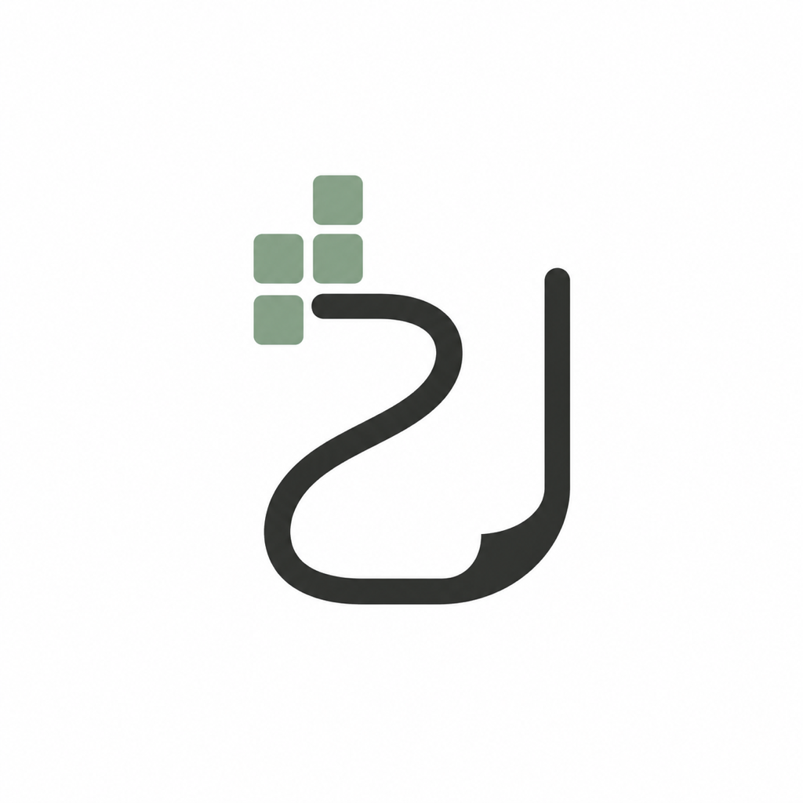
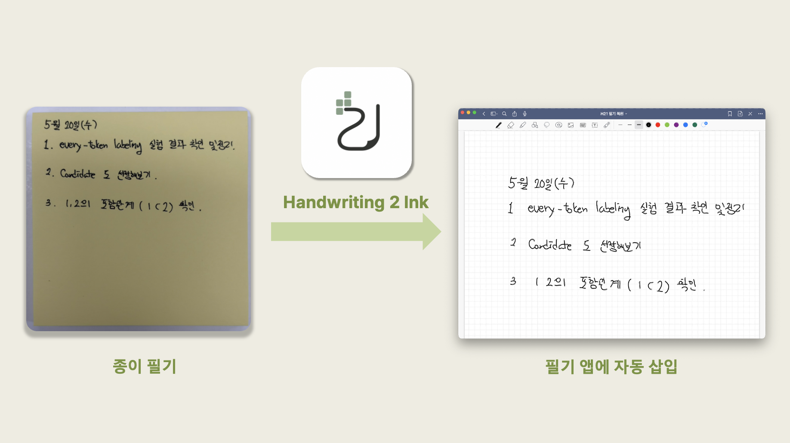
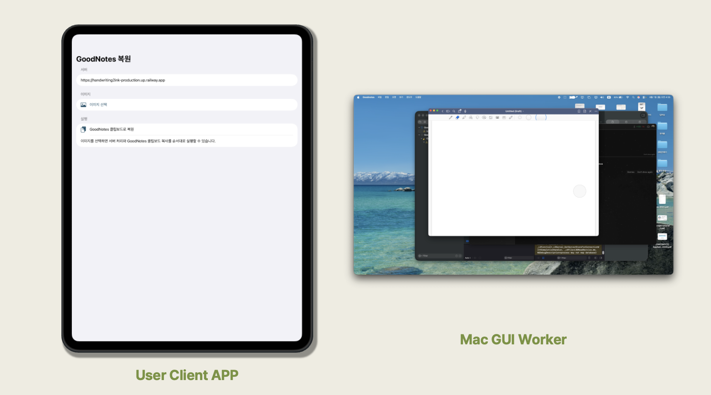
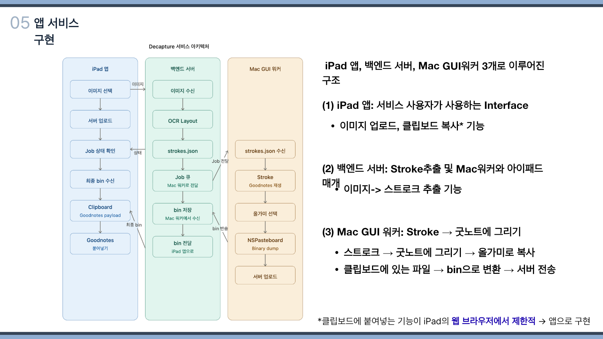
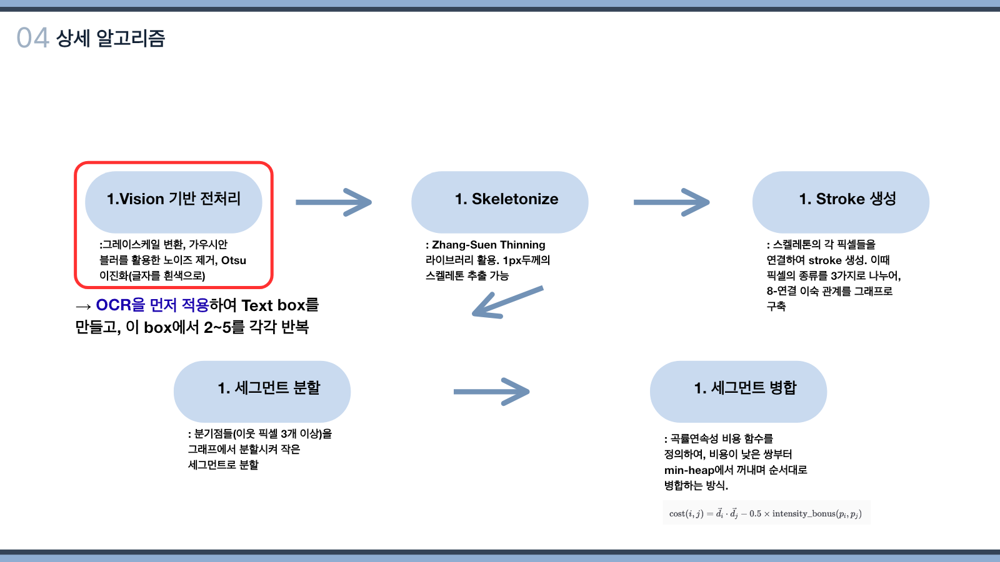

<div align="center">
  
  <h1>Handwriting2Ink</h1>
  <p><strong>손글씨 이미지를 Goodnotes에서 다시 편집할 수 있는 ink stroke로 복원하는 서비스</strong></p>
  <p>
    
    
    
    
    
    
  </p>
</div>

---

## 프로젝트 소개

Handwriting2Ink는 종이에 작성한 필기를 촬영해 업로드하면, 필기 위치와 형태를 그대로 반영하여 Goodnotes(태블릿 PC 필기 앱)에서 붙여넣을 수 있는 필기 객체로 변환하는 서비스입니다.

```text
손글씨 이미지
→ OCR layout 분석
→ skeleton 및 stroke 추출
→ Goodnotes에 실제 stroke 재생
→ 올가미 복사 및 binary 추출
→ iPad 클립보드 전달
```

단순히 필기 사진을 문서에 삽입하는 방식과 달리, Handwritng2Ink는 위의 과정을 통해 손글씨 종이 필기를 Goodenotes에서 직접 수정할 수 있는 글씨로 변환해줍니다.



<div align="center">
  <p><strong>Handwriting2Ink를 활용한 필기 복원 예시</strong></p>
</div>

## 문제 의식 🚨

- 종이 필기는 자유롭게 메모하고 구조를 표현하기 좋지만 검색,분류,재사용이 어려움. 
- 반대로 전자 필기 앱은 관리가 편리하지만, 종이 필기에 비해 학습 효과(이해효과)가 뒤쳐짐.


## 해결 방안 ☺️

### 기존 방안
종이 필기 사진을 필기앱(Goodnotes 등)에 삽입 / OCR활용 텍스트 변환

-> 아래와 같은 한계 존재

- OCR은 글자를 텍스트로 바꾸지만 필기체의 형태와 공간 배치를 보존하기 어려움.
- 손글씨 특유의 도형, 화살표와 같은 다이어그램을 보존할 수 없음. 
- 스캔 이미지는 Goodnotes에서 개별 획로 선택하거나 수정할 수 없음.
- 사람이 필기를 다시 따라 그리는 방식은 문서가 많을수록 반복 비용이 커짐.

### H2I (Ours)
- 이미지를 입력받아, **독자 개발한 알고리즘**을 통하여 Strokes.json (마우스 포인트가 지나가야 할 좌표열)을 복원.
- 복원된 Strokes.json을 활용하여, 사용자가 iPad에서 직접 Goodnotes에 붙여넣기 할 수 있도록 클립보드에 삽입.
- 사용자는 Goodnotes에서 올가미, 지우개, 형광펜 등을 활용하여 자유롭게 수정 가능! ✅

## 데모 영상 📹
### 전체 서비스 활용 과정과 서버(Mac GUI Worker) 동작 과정


[](https://youtube.com/shorts/Ik74j1NbrQU)

<div align="center">
  <p> 클릭시 데모 영상으로 이동!</p>
</div>

### iPad 앱과 Mac GUI 워커

iPad 앱은 이미지 업로드와 job 상태 확인, 최종 Goodnotes binary의 클립보드 기록을 담당한다. Mac GUI 워커는 서버에서 받은 stroke를 Goodnotes에 재생하고 올가미 복사 결과를 서버로 반환한다.



## 시스템 아키텍처

서비스는 사용자 인터페이스인 iPadOS 앱, 이미지 처리와 job orchestration을 담당하는 FastAPI 서버, Goodnotes GUI 자동화를 담당하는 Mac 워커로 분리되어 있다.



| 구성 요소 | 책임 |
| --- | --- |
| iPadOS 앱 | 이미지 선택·업로드, job polling, binary 다운로드, `UIPasteboard` 기록 |
| FastAPI 서버 | job 상태 관리, OCR layout, stroke 추출, 워커와 iPad 앱 사이의 결과 중계 |
| Mac GUI 워커 | `strokes.json` 다운로드, Goodnotes stroke 재생, 올가미 복사, `NSPasteboard` binary 업로드 |

## 핵심 기술

### 1. OCR 기반 레이아웃 분리

PaddleOCR로 텍스트 영역을 검출하고, 영역별 crop을 생성해 배경과 도형이 stroke 추출 과정에 미치는 영향을 줄였다.

### 2. Skeleton 기반 stroke 추출

OpenCV 전처리와 Zhang-Suen thinning으로 필기선을 1px skeleton으로 변환한다. 이후 8-neighbor 그래프를 구성하고 끝점·분기점을 기준으로 segment를 생성·병합해 stroke 좌표열을 만든다.



### 3. Goodnotes GUI 자동화

Swift Quartz `CGEvent`로 stroke 경로를 실제 마우스 입력처럼 재생한다. 필기 완료 후에는 올가미 선택과 복사를 수행하고, `NSPasteboard`에서 Goodnotes binary를 추출한다.

### 4. 비동기 job orchestration

FastAPI 서버가 업로드부터 `stroke_ready`, `drawing_in_goodnotes`, `bin_ready`, `delivered`까지 상태를 관리한다. iPad 앱과 Mac 워커는 동일한 job 계약을 기준으로 느슨하게 연결된다.

### 5. iPad 클립보드 브리지

서버에서 받은 binary를 `com.goodnotesapp.goodnotes5.notes` 타입으로 `UIPasteboard`에 기록해, 사용자가 Goodnotes에서 붙여넣을 수 있도록 구현했다.

## Quick Start

아래 명령은 실제 Goodnotes GUI를 조작하지 않고 API 계약과 job 상태 전이를 확인하는 목 E2E 테스트이다.

```bash
git clone https://github.com/JihunPyo/Handwriting2Ink.git
cd Handwriting2Ink

conda run -n DV python -m pip install -r backend/requirements.txt
conda run -n DV python scripts/e2e_smoke_test.py
```

FastAPI 개발 서버는 다음과 같이 실행한다.

```bash
conda run -n DV python -m uvicorn backend.app.main:app \
  --reload --host 0.0.0.0 --port 8000
```

## 상세 실행 문서

- [전체 E2E 실행 흐름](docs/e2e-test.md)
- [백엔드 서버 실행 및 API](backend/README.md)
- [iPadOS 앱 실행](frontend/ipados/README.md)
- [Mac GUI 워커 설정 및 검증](workers/macos/README.md)
- [상세 구현 계획과 API 계약](docs/development-plan.md)


## 한계 및 향후 개선

### 현재 한계

- Goodnotes GUI 자동화가 창 위치, 화면 배율, 앱 버전과 macOS 접근성 권한에 영향을 받는다.
- 필기 영역을 고정 좌표로 캘리브레이션해야 하며, GUI 워커가 순차 처리되어 전체 처리 시간이 길다.
- 복잡한 도형과 교차 stroke에서는 실제 필기 순서와 다른 경로가 생성될 수 있다.
- 현재 job 저장소는 파일 기반이므로 다중 서버 운영과 장애 복구에 한계가 있다.

### 향후 개선

- Goodnotes 필기 영역과 도구 위치의 자동 캘리브레이션
- stroke 단순화와 병합 알고리즘 개선을 통한 처리 시간 단축
- 내구성 있는 job queue와 object storage 도입
- 복잡한 표·도형·수식에 대한 layout 및 stroke 복원 품질 개선
- iPad 앱의 실시간 진행률, 재시도, 실패 복구 UX 보강

## 팀 구성

2026년 1학기 데이터분석캡스톤디자인 프로젝트로 진행했다.

| 팀원 | 담당 역할 |
| --- | --- |
| 이세혁 | 백엔드 서버 개발 |
| 표지훈 | 스트로크 복원 코어 알고리즘 개발, Mac GUI 워커·iPad 클라이언트 앱 개발  |
